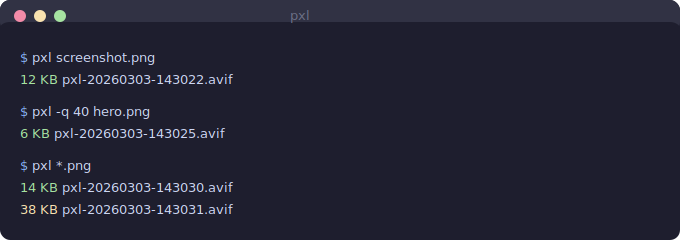

<p align="center">
  <h1 align="center">pxl</h1>
  <p align="center">Tiny screenshots for GitHub</p>
</p>

<p align="center">
  
  
  
  
  
</p>

<p align="center">
  
</p>

---

One command: **capture → crush → tiny AVIF** ready for GitHub PRs, issues, and commits.

**10-20x smaller than PNG** at visually lossless quality.

```
screencapture → sips (resize) → ffmpeg SVT-AV1 (encode)
```

Zero extra dependencies beyond macOS + Homebrew ffmpeg. No node_modules. No build step. ~300 lines of bash.

## Install

```bash
brew install ffmpeg

# Clone and symlink
git clone https://github.com/stussysenik/pxl.git ~/pxl
ln -sf ~/pxl/pxl ~/.local/bin/pxl
```

## Usage

```bash
pxl                       # Screenshot region → AVIF
pxl screenshot.png        # Crush existing image → AVIF
pxl *.png                 # Batch crush
pxl -w                    # Window capture mode
pxl -q 40 shot.png        # Aggressive compression
pxl --webp shot.png       # WebP fallback (needs: brew install webp)
pxl -s diagram.png        # SVG output (needs: brew install potrace)
```

### Default Flow (zero flags)

```
$ pxl
→ region select opens
→ capture PNG
→ downscale to 1200px max
→ encode AVIF at CRF 32
→ copy path to clipboard
→ print: "12 KB  pxl-20260303-143022.avif"
```

## Flags

| Flag | Default | Description |
|------|---------|-------------|
| `-q <1-63>` | `32` | Quality/CRF — higher = smaller file |
| `-m <px>` | `1200` | Max width before encoding |
| `-o <path>` | auto | Output path |
| `-s` | — | SVG output via potrace |
| `-w` | — | Window capture mode |
| `--webp` | — | WebP format via cwebp |
| `--no-resize` | — | Keep original dimensions |
| `--open` | — | Open result in Preview |

## Expected Sizes

| Screenshot Type | CRF 32 (default) | CRF 40 (aggressive) | Original PNG |
|----------------|-------------------|---------------------|-------------|
| Code editor | ~12-18 KB | ~6-10 KB | 200-400 KB |
| Terminal | ~8-14 KB | ~4-8 KB | 150-300 KB |
| Web page | ~18-30 KB | ~10-18 KB | 300-600 KB |
| Dialog/modal | ~5-10 KB | ~3-6 KB | 80-150 KB |

## How It Works

Uses SVT-AV1's `still-picture` mode with quantization matrices optimized for text and UI edges:

```bash
ffmpeg -i input.png \
  -vf "scale='min(1200,iw)':-2:flags=lanczos" \
  -c:v libsvtav1 -crf 32 -preset 4 \
  -svtav1-params "tune=0:still-picture=1:enable-qm=1:qm-min=0:qm-max=15" \
  -pix_fmt yuv420p -frames:v 1 -an output.avif
```

| Flag | Why |
|------|-----|
| `still-picture=1` | Single-frame optimization, no video overhead |
| `tune=0` | Visual quality — best for text/UI edges |
| `enable-qm=1` | Quantization matrices: aggressive on flat areas, preserve edges |
| `preset 4` | ~2s encode, much better compression than faster presets |
| `lanczos` | Sharpest downscale filter for text |

## Output

Color-coded file sizes:
- **Green** < 20 KB
- **Yellow** < 50 KB
- **Red** >= 50 KB

File path is automatically copied to clipboard via `pbcopy`.

## License

MIT
